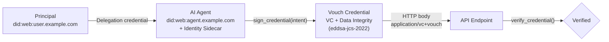

# Vouch Protocol™

<p align="center">
 
</p>

<p align="center"><strong>The open standard for the identity and accountability of AI agents.</strong></p>

<p align="center">
 <a href="https://c2pa.org"></a>
 <a href="https://contentauthenticity.org"></a>
 <a href="https://identity.foundation"></a>
 <a href="https://lfaidata.foundation"></a>
</p>

<p align="center">
 <a href="https://www.bestpractices.dev/projects/11688"></a>
 <a href="https://discord.gg/mMqx5cG9Y"></a>
 <a href="https://github.com/vouch-protocol/vouch/blob/main/LICENSE"></a>
</p>

---

AI agents now make real decisions and real API calls. They read data, move money, and act on your behalf. Almost none of them can answer three basic questions: who is this agent, what was it authorized to do, and who is accountable when it goes wrong.

Vouch Protocol gives an AI agent a verifiable, cryptographic identity, the same idea SSL/TLS brought to websites. An agent signs what it intends to do, and anyone can verify who signed it, what they were allowed to do, and that nothing was changed. It is open source, free, and built on proven standards (Verifiable Credentials, Decentralized Identifiers, and Data Integrity proofs).

## Start in one command

```bash
pip install vouch-protocol

# Configure cryptographic commit signing for your repo. One command.
vouch git init

# Every commit from now on is signed and shows as verified.
git commit -m "Secure commit"
```

## See it for yourself

Run the sixty-second demo. It shows a real agent being accepted, an impersonator being rejected, and a tampered credential being rejected, all locally, no setup.

```bash
python examples/00_the_rogue_agent.py
```

Identity you cannot fake. Authority you cannot forge. Actions you cannot alter.

---

## What is in the box

Vouch is not one tool, it is a set of them. Here is the whole map.

### On the command line
- **`vouch init`** generate an agent identity (a DID and keypair).
- **`vouch sign` / `vouch verify`** sign a payload and verify it.
- **`vouch git`** sign every git commit cryptographically, set up in one command, with a verified badge for your README.
- **`vouch scan`** find leaked Vouch key material in your code before it ships (a private key in a file, a seed in an env var, a DID document that accidentally carries a private key).
- **`vouch media`** sign images, with C2PA support.

### For your agents
- **MCP server (`vouch-mcp`)** a standalone Model Context Protocol server so any MCP client (Claude Desktop, Cursor, any agent) can create an identity, sign and verify credentials, scan for leaked keys, and decode DIDs, out of the box.
- **Identity Sidecar** keeps signing keys out of the model's context, so a prompt injection cannot read them.
- **Vouch Shield** a runtime check that inspects every tool call against your rules, like a customs officer at the door.
- **Continuous trust** heartbeats and session vouchers, so trust is a live signal that has to be renewed, not a badge that is issued once and trusted forever.

### SDKs, in the language you use
Python, TypeScript, and Go are the full reference implementations. A Rust core with idiomatic Swift, JVM (Java and Kotlin), .NET, and C wrappers shares one codebase, so every language produces byte-identical output, verified against shared test vectors. A WebAssembly build is included for the browser and the edge. See the table further down for status per language.

### Inside your AI tools
- **Claude Skill**, **OpenAI Custom GPT**, and **Gemini Gem** packages that teach your AI assistant how to add Vouch to your code, running on your own AI subscription.

### Media and the web
- **C2PA Content Credentials** for images.
- **Vouch Sonic** an audio watermark that carries provenance through sound.
- **Browser extension** for Chrome and Edge that signs and verifies content on the page.

### For your repositories
- **Gatekeeper GitHub App** verifies commit signatures on every pull request and blocks leaked Vouch keys before they merge.

### For the ecosystem
- **Agent Trust Index** an open benchmark that scans agents in the wild and measures how many can actually prove who they are. (Spoiler: today, almost none.)

---

## How it works


```mermaid
flowchart LR
  P["Principal<br/>did:web:user.example.com"]
  A["AI Agent<br/>did:web:agent.example.com<br/>+ Identity Sidecar"]
  C["Vouch Credential<br/>VC + Data Integrity<br/>(eddsa-jcs-2022)"]
  API["API Endpoint"]
  V{"Verified"}

  P -->|"Delegation credential"| A
  A -->|"sign_credential(intent)"| C
  C -->|"HTTP body<br/>application/vc+vouch"| API
  API -->|"verify_credential()"| V
```

1. **Generate identity.** Create a keypair and a DID, and publish a DID Document with a verification method.
2. **Sign the action.** The agent issues a Verifiable Credential carrying `action`, `target`, and `resource`, secured by an `eddsa-jcs-2022` Data Integrity proof. The `resource` binding is what stops an agent from being tricked into acting on the wrong thing.
3. **Send it.** The credential travels as the HTTP request body.
4. **Verify.** The receiver resolves the issuer's DID, checks the proof, the timing, and the resource, and gets back a passport describing who acted and what they intended.

The credential stays human-readable JSON. The proof attaches as a sibling object. No opaque base64 blob.

---

## Sign and verify

Sign an action:

```python
from vouch import Signer
import os

signer = Signer(private_key=os.environ["VOUCH_PRIVATE_KEY"], did=os.environ["VOUCH_DID"])

credential = signer.sign_credential(intent={
    "action": "read_database",
    "target": "users_table",
    "resource": "https://api.example.com/v1/users",
})
```

Verify it:

```python
from vouch import Verifier

is_valid, passport = Verifier.verify_credential(credential, public_key=public_key)
if is_valid:
    print(passport.sub, passport.intent)
```

`verify_credential` returns a plain `(is_valid, passport)` pair. A few lines to sign, a few to verify.

---

## Languages and interop

The crypto is written once and shared, so the output is identical across every language and is checked against the same test vectors.

| Language | Package | Status |
|---|---|---|
| Python | `vouch-protocol` (PyPI) | Stable, full reference implementation |
| TypeScript | `@vouch-protocol-official/sdk` (npm) | Stable |
| Go | `go-sidecar` | Stable signing sidecar |
| Rust | `vouch-core` (crates.io) | Ready |
| Java / Kotlin | `com.vouchprotocol:vouch-core-jvm` (Maven Central) | Ready |
| .NET | `VouchProtocol.Core` (NuGet) | Preview, needs a platform build |
| Swift | `VouchCore` (Swift Package Manager) | Preview, needs a macOS build |
| C | header shipped with the Rust core | Preview |
| WebAssembly | `core/wasm` | For browser and edge |

Every implementation does identity, signing with `eddsa-jcs-2022`, verification, the hybrid post-quantum profile, status-list revocation, and delegation, and they all verify each other's output.

---

## Post-quantum, when you need it

A credential can carry two independent proofs over the same bytes: a classical Ed25519 proof and a post-quantum ML-DSA-44 proof. A verifier can require either or both. This guards credentials signed today against a future quantum break, and lines up with the NIST CNSA 2.0 and NSM-10 migration timelines.

```python
credential = signer.sign_credential_hybrid(intent={
    "action": "submit_clinical_finding",
    "target": "trial:NCT00000001",
    "resource": "https://submissions.example.com/api/findings",
})
```

---

## Built on, and contributing to, open standards

Vouch is built on Verifiable Credentials, Decentralized Identifiers, Data Integrity proofs, and Multikey, and uses RFC 8785 JCS for deterministic, parser-independent canonical form. The project is a member of C2PA, the Content Authenticity Initiative, the Decentralized Identity Foundation, and the Linux Foundation, and the implementation is being proposed to the Linux Foundation's AI and Data community.

---

## Prior art

To keep this space free from patent capture, the project publishes **60 defensive prior-art disclosures** under CC0, covering cryptographic identity, media provenance, voice biometrics, AI safety, post-quantum cryptography, and AI coding governance. See [docs/disclosures](docs/disclosures/README.md).

---

## Use cases

- **Financial services.** A signed, accountable record of every trade or transfer an agent makes.
- **Healthcare.** An auditable trail for every access to patient data.
- **Customer service.** Proof of which agent touched which customer record, and on whose authority.
- **Agent to agent.** When one organization's agent calls another's, each can verify the other before acting.

---

## Documentation

- [Developer guide](docs/vouch_guide.md)
- [Specification](https://vouch-protocol.com/specs/)
- [Hybrid post-quantum guide](docs/hybrid-pq-implementation-guide.md)
- [Threat model](docs/THREAT_MODEL.md)
- [Integrations](vouch/integrations)
- [Examples](examples)

## Community

- Discord: [join](https://discord.gg/mMqx5cG9Y)
- GitHub Discussions: [start one](https://github.com/vouch-protocol/vouch/discussions)
- X: [@Vouch_Protocol](https://x.com/Vouch_Protocol)

## License

Apache 2.0. Free for commercial and open-source use. The 60 prior-art disclosures are CC0.

Built by [Ramprasad Gaddam](https://www.linkedin.com/in/rampy).

## Contributing

Contributions are welcome. See [CONTRIBUTING.md](CONTRIBUTING.md). The most useful help right now: more framework integrations, more interop test vectors, tutorials for regulated sectors, and independent security review.
