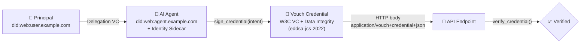
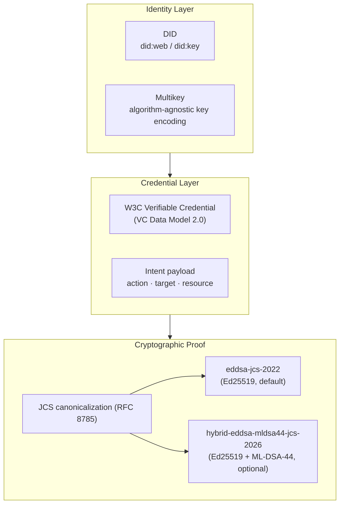

# Vouch Protocol

<p align="center">
  
</p>

<p align="center">The Open Standard for Identity & Provenance of AI Agents</strong>
</p>

<!-- Standards Body Memberships -->
<p align="center">
  <a href="https://c2pa.org"></a>
  <a href="https://contentauthenticity.org"></a>
  <a href="https://identity.foundation"></a>
  <a href="https://lfaidata.foundation"></a>
</p>

<p align="center">
  <a href="https://github.com/vouch-protocol/vouch"></a>
  <a href="https://www.bestpractices.dev/projects/11688"></a>
  <a href="https://codecov.io/gh/vouch-protocol/vouch"></a>
  <a href="https://discord.gg/VxgYkjdph"></a>
</p>

<p align="center">
  <a href="https://github.com/vouch-protocol/vouch/blob/main/LICENSE"></a>
</p>

---

## Quick Start

```bash
pip install vouch-protocol

# One command to configure SSH signing + Vouch branding
vouch git init

# All future commits are now signed and show ✅ Verified on GitHub
git commit -m "Secure commit"
```

---

## What's New in v1.0

Vouch Protocol v1.0 aligns directly with the W3C standards track:

- **W3C Verifiable Credentials** as the credential format (replacing v0.x JWS tokens).
- **W3C Data Integrity proofs** with the `eddsa-jcs-2022` cryptosuite (no JOSE, no Base64-wrapped payload, the credential remains human-readable JSON).
- **Multikey verification methods** in DID Documents (algorithm-agnostic, ML-DSA-44 ready).
- **Hybrid post-quantum profile** (`hybrid-eddsa-mldsa44-jcs-2026`) as an optional add-on for regulated deployments aligning with NIST CNSA 2.0 / NSM-10 timelines.
- **Three-way cross-implementation interop** verified across Python, TypeScript, and Go.

The legacy v0.x JWS API (`Signer.sign()`, `Verifier.verify()`) continues to work unchanged for a deprecation window. New code should prefer `Signer.sign_credential()` and `Verifier.verify_credential()`. See the W3C CG Report at [vouch-protocol.com/specs/CG-REPORT/](https://vouch-protocol.com/specs/CG-REPORT/) for the full specification.

---

> **The Open Standard for AI Agent Identity & Accountability**
> 
> When Anthropic launched MCP, they solved "how agents call tools."  
> They didn't solve "how we TRUST those agents."
> 
> **Vouch Protocol is the SSL certificate for AI agents.**

[Read the spec →](https://github.com/vouch-protocol/vouch/blob/main/docs/vouch_guide.md) | [Join Discord →](https://discord.gg/VxgYkjdph)

---

## The Problem

AI agents are making real-world API calls with **ZERO cryptographic proof** of:
- **WHO** they are
- **WHAT** they intended to do  
- **WHEN** they did it

**Examples of the risk:**
- Healthcare AI accesses patient data → HIPAA violation risk
- Financial AI makes unauthorized trades → Liability nightmare
- Customer service AI leaks data → Compliance failure

**Current solutions:**
- **DIY JWT signing** → No agent-specific features, security mistakes easy
- **Nothing** → Most people just YOLO it and hope for the best

---

## The Solution

**Vouch Protocol** provides cryptographic identity for AI agents, modeled after SSL/TLS:

- **W3C Verifiable Credentials** (W3C VC Data Model 2.0)
- **W3C Data Integrity proofs** (`eddsa-jcs-2022` cryptosuite, no JOSE/JWS dependency)
- **Decentralized Identifiers** (`did:web`, `did:key`)
- **Multikey verification methods** (algorithm-agnostic, post-quantum ready)
- **Hybrid post-quantum profile** (optional Ed25519 + ML-DSA-44 composite, `hybrid-eddsa-mldsa44-jcs-2026`)
- **Human-readable JSON** (proof attaches as a sibling object, no Base64-wrapped opaque payload)
- **Framework-agnostic** (works with MCP, LangChain, CrewAI, AutoGPT, AutoGen, Vertex AI)
- **Cross-language interop** (Python, TypeScript, Go, byte-identical canonical form)
- **Backward-compatible** (legacy v0.x JWS API still supported during deprecation window)
- **Open source** (Apache 2.0 license, CC0 prior-art portfolio)

**Think of it as:**
- SSL certificate = Proves website identity
- **Vouch Protocol = Proves AI agent identity**

---

## How It Works

### The Workflow


```mermaid
flowchart LR
    P["👤 Principal<br/>did:web:user.example.com"]
    A["🤖 AI Agent<br/>did:web:agent.example.com<br/>+ Identity Sidecar"]
    C["📄 Vouch Credential<br/>W3C VC + Data Integrity<br/>(eddsa-jcs-2022)"]
    API["🔐 API Endpoint"]
    V{"✅ Verified"}

    P -->|"Delegation VC"| A
    A -->|"sign_credential(intent)"| C
    C -->|"HTTP body<br/>application/vouch+credential+json"| API
    API -->|"verify_credential()"| V
```

**4 Simple Steps:**
1. **Generate Identity**: Create an Ed25519 keypair and a DID, publish a DID Document with a Multikey verification method.
2. **Sign Action**: Agent's sidecar issues a W3C Verifiable Credential carrying `action`, `target`, and `resource`, secured by an `eddsa-jcs-2022` Data Integrity proof.
3. **Send to API**: Transmit the credential as the HTTP request body with `Content-Type: application/vouch+credential+json` (or via the legacy `Vouch-Token` header for v0.x compatibility).
4. **Verify**: API resolves the issuer's DID, validates the Data Integrity proof, checks temporal claims and the resource binding, returns a `CredentialPassport`.

### The Trust Model


```mermaid
flowchart TB
    subgraph IDENTITY["Identity Layer"]
        DID["DID<br/>did:web / did:key"]
        MK["Multikey<br/>algorithm-agnostic key encoding"]
    end
    subgraph FORMAT["Credential Layer"]
        VC["W3C Verifiable Credential<br/>(VC Data Model 2.0)"]
        INTENT["Intent payload<br/>action · target · resource"]
    end
    subgraph CRYPTO["Cryptographic Proof"]
        JCS["JCS canonicalization (RFC 8785)"]
        DEFAULT["eddsa-jcs-2022<br/>(Ed25519, default)"]
        HYBRID["hybrid-eddsa-mldsa44-jcs-2026<br/>(Ed25519 + ML-DSA-44, optional)"]
    end
    IDENTITY --> FORMAT
    FORMAT --> CRYPTO
    JCS --> DEFAULT
    JCS --> HYBRID
```

**Trust = W3C Verifiable Credentials + Data Integrity + Decentralized Identifiers + Multikey, with optional hybrid post-quantum signatures.** The same math that secures SSL/TLS plus the W3C primitives that secure verifiable credentials elsewhere on the web, applied to AI agents.

---

## Why Vouch Protocol?

### vs. DIY JWT

| Feature | Vouch Protocol | DIY JWT |
|---------|---------------|---------|
| **Agent-specific** | ✅ (designed for agents) | ❌ (generic) |
| **MCP integration** | ✅ (native) | ❌ (manual) |
| **Framework integrations** | ✅ (LangChain, CrewAI, etc.) | ❌ |
| **Audit trail format** | ✅ (W3C VC standardized) | ❌ (custom) |
| **W3C-aligned** | ✅ (`eddsa-jcs-2022` Data Integrity) | ❌ |
| **Multikey verification methods** | ✅ (algorithm-agnostic) | ❌ |
| **Hybrid post-quantum signatures** | ✅ (`hybrid-eddsa-mldsa44-jcs-2026`) | ❌ |
| **Cross-implementation interop tests** | ✅ (Python, TypeScript, Go) | ❌ |
| **Security best practices** | ✅ (built-in) | ⚠️ (easy to mess up) |

---

## Quick Start

### 1. Install
```bash
pip install vouch-protocol
```

### 2. Generate Identity
```bash
vouch init --domain your-agent.com
```

### 3. Sign an Action (Agent Side)

**v1.0 path (W3C VC + Data Integrity, recommended):**
```python
from vouch import Signer
import os

signer = Signer(
    private_key=os.environ['VOUCH_PRIVATE_KEY'],
    did=os.environ['VOUCH_DID']
)

credential = signer.sign_credential(intent={
    'action': 'read_database',
    'target': 'users_table',
    'resource': 'https://api.example.com/v1/users',
})
# Send credential as the JSON body of the API request, content-type
# application/vouch+credential+json
```

**Legacy v0.x path (JWS, still supported):**
```python
token = signer.sign({'action': 'read_database', 'target': 'users'})
# Include token in Vouch-Token header
```

### 4. Verify (API Side)

**v1.0 path:**
```python
from fastapi import FastAPI, Request, HTTPException
from vouch import Verifier

app = FastAPI()

@app.post("/api/resource")
async def protected_route(request: Request):
    credential = await request.json()
    public_key = '{"kty":"OKP", ...}'  # Resolved from did:web or trusted root

    is_valid, passport = Verifier.verify_credential(credential, public_key=public_key)
    if not is_valid:
        raise HTTPException(status_code=401, detail="Untrusted Agent")

    return {
        "status": "Verified",
        "agent": passport.sub,
        "intent": passport.intent,
    }
```

**Legacy v0.x path:**
```python
from vouch import Verifier

@app.post("/api/legacy")
def legacy_route(vouch_token: str = Header(alias="Vouch-Token")):
    is_valid, passport = Verifier.verify(vouch_token, public_key_jwk=public_key)
    if not is_valid:
        raise HTTPException(status_code=401, detail="Untrusted Agent")
    return {"status": "Verified", "agent": passport.sub}
```

**That's it.** A few lines to sign, a few to verify, on either path.

---

## Integrations

Works with all major AI frameworks out-of-the-box:

- **Model Context Protocol (MCP)**: native integration for Claude Desktop and Cursor
- **LangChain**: sign tool calls automatically
- **CrewAI**: multi-agent identity management
- **AutoGPT**: autonomous agent signing
- **AutoGen**: Microsoft multi-agent framework
- **Google Vertex AI**: sign function calls
- **Google ADK**: native ADK tool integration
- **n8n**: low-code agent workflows

[See all integrations →](https://github.com/vouch-protocol/vouch/tree/main/vouch/integrations)

---

## Enterprise Features

- **Key Rotation**: automatic rotating keys for production
- **Voice AI Signing**: sign audio frames in real-time
- **Cloud KMS**: AWS KMS, GCP Cloud KMS, Azure Key Vault
- **Reputation Scoring**: track agent behavior over time
- **Revocation Registry**: blacklist compromised keys
- **Redis Caching**: production-scale verification
- **Hybrid Post-Quantum Profile**: optional Ed25519 + ML-DSA-44 composite signatures (`hybrid-eddsa-mldsa44-jcs-2026`) for regulated deployments aligning with NIST CNSA 2.0 / NSM-10 migration timelines

### Hybrid Post-Quantum Example

```python
# Optional v1.0 profile, requires `pip install pqcrypto`
credential = signer.sign_credential_hybrid(intent={
    'action': 'submit_clinical_finding',
    'target': 'trial:NCT00000001',
    'resource': 'https://fda-submissions.example.com/api/findings',
})
# Carries both Ed25519 and ML-DSA-44 signatures over the same JCS canonical form.
# Verification REQUIRES both to validate.
```

---

## Use Cases

### Financial Services
```python
# SEC-compliant trade logging
agent.sign({'action': 'execute_trade', 'amount': 10000, 'symbol': 'AAPL'})
```

### Customer Service
```python
# Data access accountability
agent.sign({'action': 'read_customer_data', 'customer_id': 'cust_abc'})
```

### Healthcare AI
```python
# HIPAA-compliant audit trail
agent.sign({'action': 'access_phi', 'patient_id': '12345'})
```

[See full examples →](https://github.com/vouch-protocol/vouch/tree/main/examples)

---

## Documentation

- [Quick Start](https://github.com/vouch-protocol/vouch#quick-start)
- [W3C Community Group Report (v1.6 normative spec)](https://vouch-protocol.com/specs/CG-REPORT/)
- [Hybrid Post-Quantum Implementation Guide](https://github.com/vouch-protocol/vouch/blob/main/docs/hybrid-pq-implementation-guide.md)
- [Protocol Specification (developer guide)](https://github.com/vouch-protocol/vouch/blob/main/docs/vouch_guide.md)
- [Integration Guides](https://github.com/vouch-protocol/vouch/tree/main/vouch/integrations)
- [Threat Model and Security Considerations](https://github.com/vouch-protocol/vouch/blob/main/docs/THREAT_MODEL.md)
- [Defensive Prior Art Disclosures (47 PADs, CC0)](https://github.com/vouch-protocol/vouch/tree/main/docs/disclosures)
- [FAQ and Discussions](https://github.com/vouch-protocol/vouch/discussions)

---

## Community

- **Discord** - Ask questions, share use cases → [Join now](https://discord.gg/VxgYkjdph)
- **GitHub Discussions** - Technical discussions → [Start a discussion](https://github.com/vouch-protocol/vouch/discussions)
- **Twitter/X** - Updates and announcements → [@Vouch_Protocol](https://x.com/Vouch_Protocol)

---

## Roadmap

### v1.6 (current release)

- [x] **W3C Verifiable Credentials + Data Integrity** (`eddsa-jcs-2022` cryptosuite)
- [x] **Multikey verification methods** (algorithm-agnostic, multibase + multicodec)
- [x] **Hybrid post-quantum profile** (`hybrid-eddsa-mldsa44-jcs-2026`, NIST CNSA 2.0 / NSM-10 aligned)
- [x] **Three-language reference implementation** (Python, TypeScript, Go) with byte-identical canonical form via RFC 8785 JCS, verified against shared test vectors
- [x] **W3C CG Report drafted** and submitted to the Credentials Community Group for incubation
- [x] **47 Prior Art Disclosures** (CC0 defensive publications)
- [x] Identity Sidecar architecture (LLM-isolated keys)
- [x] Heartbeat Protocol with adaptive Trust Entropy
- [x] Resource-bound delegation chains with capability narrowing
- [x] MCP integration (Claude Desktop, Cursor)
- [x] Framework adapters (LangChain, CrewAI, AutoGPT, AutoGen, Vertex AI, Google ADK, n8n)
- [x] C2PA Content Credentials integration
- [x] Audio watermarking (Vouch Sonic, sub-band steganography)
- [x] DID-linked voice biometric enrollment
- [x] Browser extension (Chrome / Edge content signing)
- [x] GitHub App and Cloudflare Workers verification gateway

### Next (v1.7 and beyond)

- [ ] Independent third-party cryptographic security audit (Trail of Bits / NCC Group / Cure53)
- [ ] W3C VCWG and DIWG transition (charter or rechartering proposal)
- [ ] Algorithm Quorum verification (M-of-N cryptosuite diversity, per PAD-046)
- [ ] Verifiable Delay Function rate-limiting for high-stakes agent actions (per PAD-047)
- [ ] Cryptographic Weight Binding for model-intrinsic AI identity (per PAD-043)
- [ ] Ephemeral ZK-State Channels for high-frequency agent-to-agent negotiation (per PAD-044)
- [ ] Retrieval-anchored proof of non-hallucination (per PAD-045)
- [ ] Standardized agent ledger metadata schema (per PAD-042)
- [ ] Edge-first WASM + ONNX client-side processing
- [ ] Hardware key support (YubiKey, TPM, Secure Enclave)
- [ ] Native Rust implementation for edge and embedded deployments

[View full roadmap and issue tracker →](https://github.com/vouch-protocol/vouch/issues)

---

## License

**Apache License 2.0**: See [LICENSE](https://github.com/vouch-protocol/vouch/blob/main/LICENSE)

You can use this freely in commercial and open-source projects.

The 47 defensive prior-art disclosures are released under **CC0 1.0 Universal** to ensure ecosystem freedom from patent capture.

*The Vouch Protocol specification is being developed as a W3C standards track submission via the Credentials Community Group. The implementation is also being proposed to the Linux Foundation's AI & Data Foundation.*

---

## Acknowledgments

Inspired by:
- **SSL/TLS** (the gold standard for identity)
- **OAuth 2.0** (federated identity done right)
- **W3C Verifiable Credentials** (the future of digital identity)

Built by [Ramprasad Gaddam](https://www.linkedin.com/in/rampy) ([Twitter/X](https://x.com/rampyg))

---

## Contributing

Contributions welcome. See [CONTRIBUTING.md](https://github.com/vouch-protocol/vouch/blob/main/CONTRIBUTING.md).

**Areas where help is most useful:**
- [ ] Additional framework integrations (Haystack, Semantic Kernel, LlamaIndex, others)
- [ ] Cross-implementation interop test vectors (additional edge cases for JCS, VC, hybrid PQ)
- [ ] Tutorials and worked examples for regulated-sector deployments
- [ ] Independent security review and audit
- [ ] Reference implementations in additional languages (Rust, Java, .NET)

---

**Star this repo if you find it useful.**

[Star on GitHub](https://github.com/vouch-protocol/vouch) | [Join Discord](https://discord.gg/VxgYkjdph) | [Follow on X](https://x.com/Vouch_Protocol)

---

## Prior Art Disclosures

To ensure ecosystem freedom, we publish **38 defensive prior art disclosures** (CC0 public domain) covering novel methods across cryptographic identity, media provenance, voice biometrics, AI safety, and content authenticity:

| ID | Title | Category |
|----|-------|----------|
| [PAD-001](docs/disclosures/PAD-001-cryptographic-agent-identity.md) | Cryptographic Agent Identity | Identity |
| [PAD-002](docs/disclosures/PAD-002-chain-of-custody.md) | Chain of Custody Delegation | Identity |
| [PAD-003](docs/disclosures/PAD-003-identity-sidecar.md) | Identity Sidecar Pattern | Architecture |
| [PAD-004](docs/disclosures/PAD-004-smart-scan-verification.md) | DOM-Traversing Signature Matching | Verification |
| [PAD-005](docs/disclosures/PAD-005-reverse-lookup-registry.md) | Detached Signature Recovery | Verification |
| [PAD-006](docs/disclosures/PAD-006-trust-graph-url-chaining.md) | URL-Based Credential Chaining | Trust |
| [PAD-007](docs/disclosures/PAD-007-ghost-signature-telemetry.md) | Automated Provenance via Input Telemetry | Provenance |
| [PAD-008](docs/disclosures/PAD-008-hybrid-ssh-verification.md) | Hybrid Identity Bootstrapping | Identity |
| [PAD-009](docs/disclosures/PAD-009-localhost-identity-bridge.md) | Unified Local Identity via Localhost Bridge | Architecture |
| [PAD-010](docs/disclosures/PAD-010-semantic-consent-signing.md) | Context-Adaptive Semantic Consent | Privacy |
| [PAD-011](docs/disclosures/PAD-011-hierarchical-discovery-protocol.md) | Hierarchical Discovery Protocol | Discovery |
| [PAD-012](docs/disclosures/PAD-012-vouch-covenant.md) | Executable Usage Covenants in Media Manifests | Media / Rights |
| [PAD-013](docs/disclosures/PAD-013-vouch-airgap.md) | Air-Gapped Identity via Psychoacoustic Steganography | Audio |
| [PAD-014](docs/disclosures/PAD-014-vouch-sonic.md) | Robust Acoustic Provenance via Steganography | Audio |
| [PAD-015](docs/disclosures/PAD-015-ambient-witness-protocol.md) | Ambient Witness Protocol (BLE Crowdsourcing) | IoT / Provenance |
| [PAD-016](docs/disclosures/PAD-016-dynamic-credential-renewal.md) | Dynamic Credential Renewal ("Heartbeat Protocol") | Identity |
| [PAD-017](docs/disclosures/PAD-017-cryptographic-proof-of-reasoning.md) | Cryptographic Proof of Reasoning | AI Safety |
| [PAD-018](docs/disclosures/PAD-018-model-lineage-provenance.md) | Model Lineage Provenance ("Birth Certificate Protocol") | AI Safety |
| [PAD-019](docs/disclosures/PAD-019-glass-channel-protocol.md) | Transparent Agent Communication | AI Safety |
| [PAD-020](docs/disclosures/PAD-020-ratchet-lock-protocol.md) | Capability Acquisition Containment | AI Safety |
| [PAD-021](docs/disclosures/PAD-021-inverse-capability-protocol.md) | Graduated Autonomy via Inverse Capability Scaling | AI Safety |
| [PAD-022](docs/disclosures/PAD-022-swarm-limits-protocol.md) | Agent Population Governance | AI Safety |
| [PAD-023](docs/disclosures/PAD-023-content-policy-watermarking.md) | Machine-Readable Content Usage Policies in Audio Watermarks | Audio / Rights |
| [PAD-024](docs/disclosures/PAD-024-temporal-video-fingerprinting.md) | Temporal Perceptual Hashing for Video Provenance | Video |
| [PAD-025](docs/disclosures/PAD-025-edge-first-content-provenance.md) | Edge-First Content Provenance via Client-Side WASM | Architecture |
| [PAD-026](docs/disclosures/PAD-026-did-linked-voiceprint-enrollment.md) | DID-Linked Voice Biometric Enrollment | Voice / Biometrics |
| [PAD-027](docs/disclosures/PAD-027-shamir-split-biometric-recovery.md) | Shamir Secret Sharing of Biometric Enrollment Data | Recovery / Biometrics |
| [PAD-028](docs/disclosures/PAD-028-cross-modal-identity-provenance.md) | Unified Cross-Modal Identity-Bound Provenance | Multi-Modal / Identity |
| [PAD-029](docs/disclosures/PAD-029-eldear-scam-protection-identity.md) | Identity-Verified Communication Shield | Elder Safety / Voice |
| [PAD-030](docs/disclosures/PAD-030-zk-reputation-portability.md) | Zero-Knowledge Reputation Portability | Privacy / Trust |
| [PAD-031](docs/disclosures/PAD-031-canary-provenance-honeypots.md) | Adversarial Provenance Honeypots | Adversarial Detection |
| [PAD-032](docs/disclosures/PAD-032-cryptographic-mortality-protocol.md) | Cryptographic Mortality Protocol | Identity Lifecycle |
| [PAD-033](docs/disclosures/PAD-033-zk-pq-signature-compression.md) | ZK Proof Compression for Post-Quantum Signatures | Post-Quantum / ZKP |
| [PAD-034](docs/disclosures/PAD-034-composite-threshold-swarm-consensus.md) | Composite Threshold Aggregation for Swarm Consensus | Post-Quantum / Swarm |
| [PAD-035](docs/disclosures/PAD-035-async-chunked-edge-pq-signatures.md) | Asynchronous Chunked Verification and Edge PQ Signatures | Post-Quantum / Edge |
| [PAD-036](docs/disclosures/PAD-036-aggregated-reputation-scoring.md) | Aggregated Reputation Scoring via Verifiable State Receipts | Trust / Enterprise |
| [PAD-037](docs/disclosures/PAD-037-credential-federation.md) | Cross-Protocol Agent Credential Federation | Identity / Enterprise |
| [PAD-038](docs/disclosures/PAD-038-agent-capability-discovery.md) | Decentralized Agent Capability Discovery | Discovery / Multi-Agent |

[View all disclosures →](docs/disclosures/README.md)
