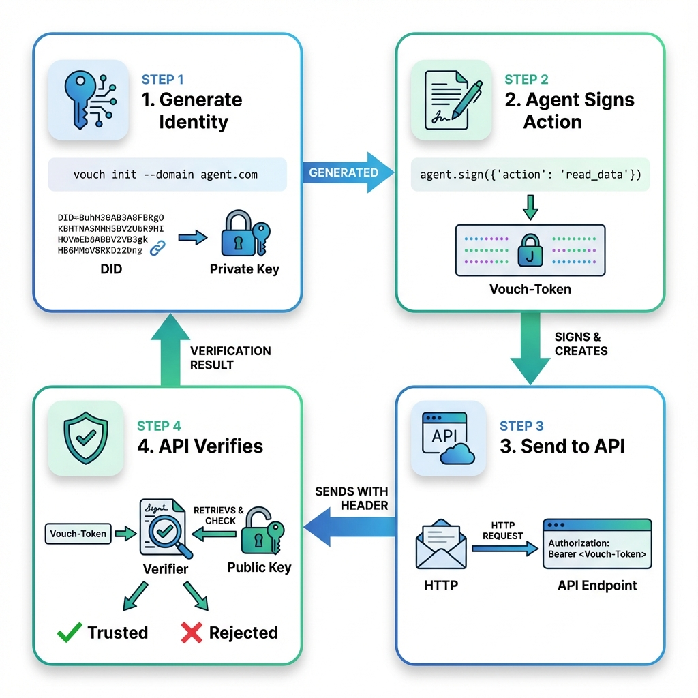
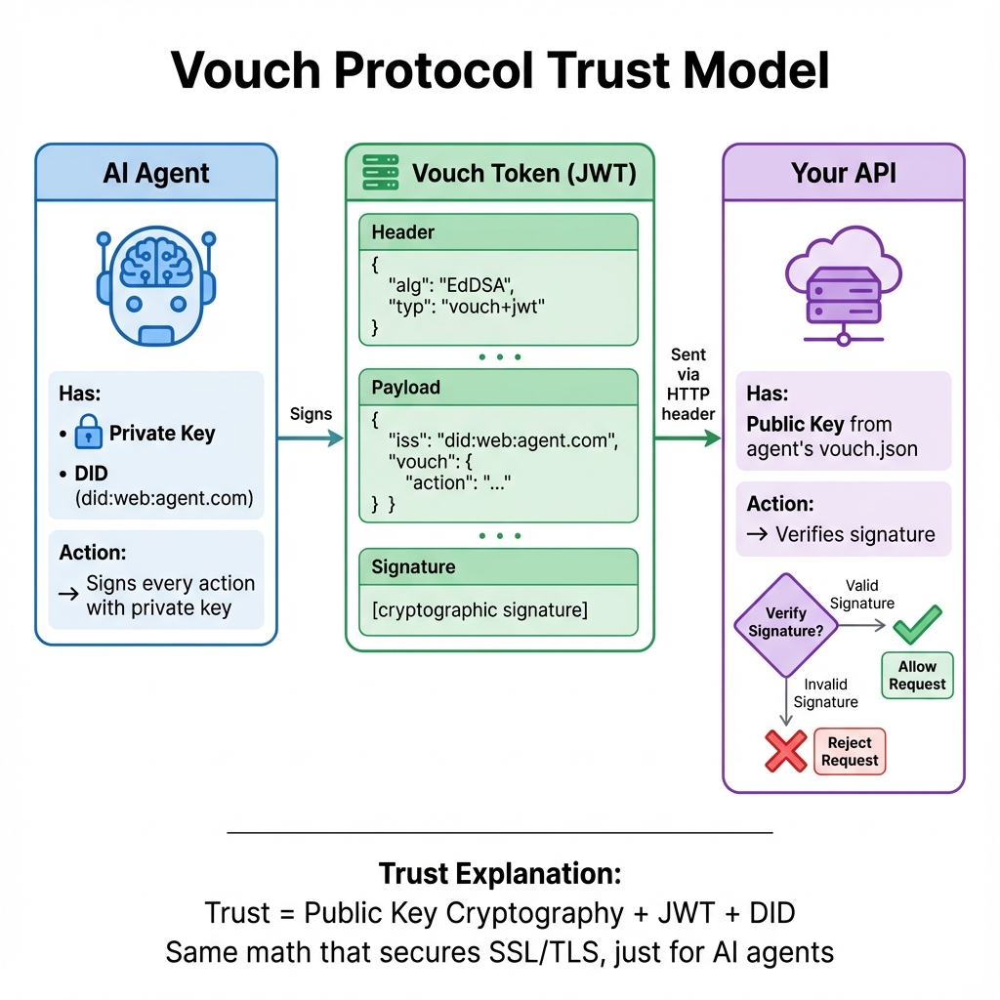

# Vouch Protocol

<p align="center">
  
</p>

<p align="center">The Open Standard for Identity & Provenance of AI Agents</strong>
</p>

<!-- Standards Body Memberships -->
<p align="center">
  <a href="https://c2pa.org"></a>
  <a href="https://contentauthenticity.org"></a>
  <a href="https://www.w3.org"></a>
  <a href="https://identity.foundation"></a>
  <a href="https://lfaidata.foundation"></a>
</p>

<p align="center">
  <a href="https://github.com/vouch-protocol/vouch"></a>
  <a href="https://www.bestpractices.dev/projects/11688"></a>
  <a href="https://codecov.io/gh/vouch-protocol/vouch"></a>
  <a href="https://discord.gg/VxgYkjdph"></a>
</p>

<p align="center">
  <a href="https://github.com/vouch-protocol/vouch/blob/main/LICENSE"></a>
</p>

---

## ⚡ Quick Start

```bash
pip install vouch-protocol

# One command to configure SSH signing + Vouch branding
vouch git init

# All future commits are now signed and show ✅ Verified on GitHub
git commit -m "Secure commit"
```

---

> **The Open Standard for AI Agent Identity & Accountability**
> 
> When Anthropic launched MCP, they solved "how agents call tools."  
> They didn't solve "how we TRUST those agents."
> 
> **Vouch Protocol is the SSL certificate for AI agents.**

[Read the spec →](https://github.com/vouch-protocol/vouch/blob/main/docs/vouch_guide.md) | [Join Discord →](https://discord.gg/VxgYkjdph)

---

## The Problem

AI agents are making real-world API calls with **ZERO cryptographic proof** of:
- **WHO** they are
- **WHAT** they intended to do  
- **WHEN** they did it

**Examples of the risk:**
- Healthcare AI accesses patient data → HIPAA violation risk
- Financial AI makes unauthorized trades → Liability nightmare
- Customer service AI leaks data → Compliance failure

**Current solutions:**
- **DIY JWT signing** → No agent-specific features, security mistakes easy
- **Nothing** → Most people just YOLO it and hope for the best

---

## The Solution

**Vouch Protocol** provides cryptographic identity for AI agents, modeled after SSL/TLS:

✅ **Ed25519 signatures** (industry-standard cryptography)  
✅ **JWK key format** (works with existing infrastructure)  
✅ **Audit trail** (cryptographic proof of every action)  
✅ **Framework-agnostic** (works with MCP, LangChain, CrewAI, etc.)  
✅ **Open source** (Apache 2.0 license)

**Think of it as:**
- SSL certificate = Proves website identity
- **Vouch Protocol = Proves AI agent identity**

---

## How It Works

### The Workflow



**4 Simple Steps:**
1. **Generate Identity** - Create keypair and DID
2. **Sign Action** - Agent signs every API call
3. **Send to API** - Include token in HTTP header
4. **Verify** - API checks signature with public key

### The Trust Model



**Trust = Public Key Cryptography + JWT + DID**  
The same math that secures SSL/TLS, just for AI agents.

---

## Why Vouch Protocol?

### vs. DIY JWT

| Feature | Vouch Protocol | DIY JWT |
|---------|---------------|---------|
| **Agent-specific** | ✅ (designed for agents) | ❌ (generic) |
| **MCP integration** | ✅ (native) | ❌ (manual) |
| **Framework integrations** | ✅ (LangChain, CrewAI, etc.) | ❌ |
| **Audit trail format** | ✅ (standardized) | ❌ (custom) |
| **Security best practices** | ✅ (built-in) | ⚠️ (easy to mess up) |

---

## Quick Start

### 1. Install
```bash
pip install vouch-protocol
```

### 2. Generate Identity
```bash
vouch init --domain your-agent.com
```

### 3. Sign an Action (Agent Side)
```python
from vouch import Signer
import os

signer = Signer(
    private_key=os.environ['VOUCH_PRIVATE_KEY'],
    did=os.environ['VOUCH_DID']
)

token = signer.sign({'action': 'read_database', 'target': 'users'})
# Include token in Vouch-Token header
```

### 4. Verify (API Side)
```python
from fastapi import FastAPI, Header, HTTPException
from vouch import Verifier

app = FastAPI()

@app.post("/api/resource")
def protected_route(vouch_token: str = Header(alias="Vouch-Token")):
    public_key = '{"kty":"OKP"...}' # From agent's vouch.json
    
    is_valid, passport = Verifier.verify(vouch_token, public_key_jwk=public_key)
    
    if not is_valid:
        raise HTTPException(status_code=401, detail="Untrusted Agent")
        
    return {"status": "Verified", "agent": passport.sub}
```

**That's it.** 3 lines to sign, 3 lines to verify.

---

## Integrations

Works with all major AI frameworks out-of-the-box:

- ✅ **Model Context Protocol (MCP)** - Native integration for Claude Desktop & Cursor
- ✅ **LangChain** - Sign tool calls automatically
- ✅ **CrewAI** - Multi-agent identity management
- ✅ **AutoGPT** - Autonomous agent signing
- ✅ **AutoGen** - Microsoft multi-agent framework
- ✅ **Google Vertex AI** - Sign function calls
- ✅ **n8n** - Low-code agent workflows

[See all integrations →](https://github.com/vouch-protocol/vouch/tree/main/vouch/integrations)

---

## Enterprise Features

- 🔐 **Key Rotation** - Automatic rotating keys for production
- 🎙️ **Voice AI Signing** - Sign audio frames in real-time  
- ☁️ **Cloud KMS** - AWS KMS, GCP Cloud KMS, Azure Key Vault
- 📊 **Reputation Scoring** - Track agent behavior over time
- 🚫 **Revocation Registry** - Blacklist compromised keys
- ⚡ **Redis Caching** - Production-scale verification

---

## 🎯 Use Cases

### Financial Services
```python
# SEC-compliant trade logging
agent.sign({'action': 'execute_trade', 'amount': 10000, 'symbol': 'AAPL'})
```

### Customer Service
```python
# Data access accountability
agent.sign({'action': 'read_customer_data', 'customer_id': 'cust_abc'})
```

### Healthcare AI
```python
# HIPAA-compliant audit trail
agent.sign({'action': 'access_phi', 'patient_id': '12345'})
```

[See full examples →](https://github.com/vouch-protocol/vouch/tree/main/examples)

---

## 📚 Documentation

- 🚀 [Quick Start](https://github.com/vouch-protocol/vouch#quick-start)
- 🔧 [Integration Guides](https://github.com/vouch-protocol/vouch/tree/main/vouch/integrations)
- 📖 [Protocol Specification](https://github.com/vouch-protocol/vouch/blob/main/docs/vouch_guide.md)
- 🏢 [Enterprise Features](https://github.com/vouch-protocol/vouch#enterprise-features)
- 🛡️ [Security Best Practices](https://github.com/vouch-protocol/vouch/blob/main/docs/vouch_guide.md)
- ❓ [FAQ](https://github.com/vouch-protocol/vouch/discussions)

---

## 🤝 Community

- **Discord** - Ask questions, share use cases → [Join now](https://discord.gg/VxgYkjdph)
- **GitHub Discussions** - Technical discussions → [Start a discussion](https://github.com/vouch-protocol/vouch/discussions)
- **Twitter/X** - Updates and announcements → [@Vouch_Protocol](https://x.com/Vouch_Protocol)

---

## 🛣️ Roadmap

- [x] Core protocol (Ed25519, JWK, JWT)
- [x] MCP integration
- [x] LangChain, CrewAI, AutoGPT integrations
- [x] C2PA Content Credentials integration (image signing & verification)
- [x] 27 Prior Art Disclosures (CC0 defensive publications)
- [x] Audio watermarking (Vouch Sonic - spread-spectrum steganography)
- [x] Voice biometric enrollment (DID-linked voiceprints)
- [ ] W3C standardization track (in progress)
- [ ] Edge-first WASM + ONNX client-side processing
- [ ] Multi-signature support
- [ ] Hardware key support (YubiKey, etc.)
- [ ] Browser extension (verify agents in real-time)

[View full roadmap →](https://github.com/vouch-protocol/vouch/issues)

---

## 📜 License

**Apache License 2.0** - See [LICENSE](https://github.com/vouch-protocol/vouch/blob/main/LICENSE)

You can use this freely in commercial and open-source projects.

*The Vouch Protocol specification is being developed as a W3C standards track submission. The implementation is also being submitted to the Linux Foundation's AI & Data Foundation (LF AI & Data).*

---

## 🙏 Acknowledgments

Inspired by:
- **SSL/TLS** (the gold standard for identity)
- **OAuth 2.0** (federated identity done right)
- **W3C Verifiable Credentials** (the future of digital identity)

Built by [Ramprasad Gaddam](https://www.linkedin.com/in/rampy) ([Twitter/X](https://x.com/rampyg))

---

## 🚀 Contributing

We welcome contributions! See [CONTRIBUTING.md](https://github.com/vouch-protocol/vouch/blob/main/CONTRIBUTING.md).

**Areas where we need help:**
- [ ] Add integrations (Haystack, Semantic Kernel, etc.)
- [ ] Improve documentation
- [ ] Write tutorials
- [ ] Build examples
- [ ] Security audits

---

**⭐ Star this repo if you find it useful!**

[Star on GitHub](https://github.com/vouch-protocol/vouch) | [Join Discord](https://discord.gg/VxgYkjdph) | [Follow on Twitter](https://x.com/Vouch_Protocol)

---

## 📜 Prior Art Disclosures

To ensure ecosystem freedom, we publish **27 defensive prior art disclosures** (CC0 public domain) covering novel methods across cryptographic identity, media provenance, voice biometrics, AI safety, and content authenticity:

| ID | Title | Category |
|----|-------|----------|
| [PAD-001](docs/disclosures/PAD-001-cryptographic-agent-identity.md) | Cryptographic Agent Identity | Identity |
| [PAD-002](docs/disclosures/PAD-002-chain-of-custody.md) | Chain of Custody Delegation | Identity |
| [PAD-003](docs/disclosures/PAD-003-identity-sidecar.md) | Identity Sidecar Pattern | Architecture |
| [PAD-004](docs/disclosures/PAD-004-smart-scan-verification.md) | DOM-Traversing Signature Matching | Verification |
| [PAD-005](docs/disclosures/PAD-005-reverse-lookup-registry.md) | Detached Signature Recovery | Verification |
| [PAD-006](docs/disclosures/PAD-006-trust-graph-url-chaining.md) | URL-Based Credential Chaining | Trust |
| [PAD-007](docs/disclosures/PAD-007-ghost-signature-telemetry.md) | Automated Provenance via Input Telemetry | Provenance |
| [PAD-008](docs/disclosures/PAD-008-hybrid-ssh-verification.md) | Hybrid Identity Bootstrapping | Identity |
| [PAD-009](docs/disclosures/PAD-009-localhost-identity-bridge.md) | Unified Local Identity via Localhost Bridge | Architecture |
| [PAD-010](docs/disclosures/PAD-010-semantic-consent-signing.md) | Context-Adaptive Semantic Consent | Privacy |
| [PAD-011](docs/disclosures/PAD-011-hierarchical-discovery-protocol.md) | Hierarchical Discovery Protocol | Discovery |
| [PAD-012](docs/disclosures/PAD-012-vouch-covenant.md) | Executable Usage Covenants in Media Manifests | Media / Rights |
| [PAD-013](docs/disclosures/PAD-013-vouch-airgap.md) | Air-Gapped Identity via Psychoacoustic Steganography | Audio |
| [PAD-014](docs/disclosures/PAD-014-vouch-sonic.md) | Robust Acoustic Provenance via Steganography | Audio |
| [PAD-015](docs/disclosures/PAD-015-ambient-witness-protocol.md) | Ambient Witness Protocol (BLE Crowdsourcing) | IoT / Provenance |
| [PAD-016](docs/disclosures/PAD-016-dynamic-credential-renewal.md) | Dynamic Credential Renewal ("Heartbeat Protocol") | Identity |
| [PAD-017](docs/disclosures/PAD-017-cryptographic-proof-of-reasoning.md) | Cryptographic Proof of Reasoning | AI Safety |
| [PAD-018](docs/disclosures/PAD-018-model-lineage-provenance.md) | Model Lineage Provenance ("Birth Certificate Protocol") | AI Safety |
| [PAD-019](docs/disclosures/PAD-019-glass-channel-protocol.md) | Transparent Agent Communication | AI Safety |
| [PAD-020](docs/disclosures/PAD-020-ratchet-lock-protocol.md) | Capability Acquisition Containment | AI Safety |
| [PAD-021](docs/disclosures/PAD-021-inverse-capability-protocol.md) | Graduated Autonomy via Inverse Capability Scaling | AI Safety |
| [PAD-022](docs/disclosures/PAD-022-swarm-limits-protocol.md) | Agent Population Governance | AI Safety |
| [PAD-023](docs/disclosures/PAD-023-content-policy-watermarking.md) | Machine-Readable Content Usage Policies in Audio Watermarks | Audio / Rights |
| [PAD-024](docs/disclosures/PAD-024-temporal-video-fingerprinting.md) | Temporal Perceptual Hashing for Video Provenance | Video |
| [PAD-025](docs/disclosures/PAD-025-edge-first-content-provenance.md) | Edge-First Content Provenance via Client-Side WASM | Architecture |
| [PAD-026](docs/disclosures/PAD-026-did-linked-voiceprint-enrollment.md) | DID-Linked Voice Biometric Enrollment | Voice / Biometrics |
| [PAD-027](docs/disclosures/PAD-027-shamir-split-biometric-recovery.md) | Shamir Secret Sharing of Biometric Enrollment Data | Recovery / Biometrics |

[View all disclosures →](docs/disclosures/README.md)
