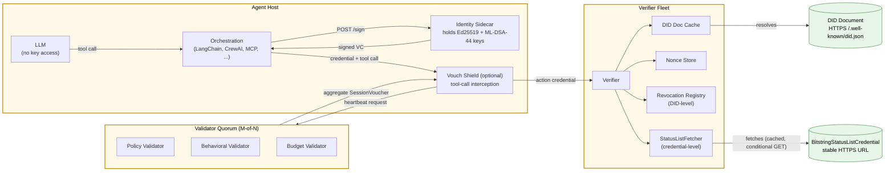

# 1.1 System Topology

The high-level component map of a Vouch deployment. Shows the agent host
(LLM + orchestration + sidecar + optional Shield), the validator quorum
that issues SessionVouchers, the verifier fleet that consumes
credentials, and the public artifacts (DID Document, BitstringStatusList
credential) that anchor verification.

Trust boundaries are highlighted: keys never leave the sidecar process,
the LLM never sees them, and verifiers compose multiple checks
(DID resolution, nonce store, revocation registry, status list) in
parallel.

## What it answers

- Where do keys live? In the sidecar, in its own process.
- What can the LLM see? Tool calls and their results, never keys.
- Who issues SessionVouchers? The validator quorum, M-of-N.
- What does a verifier consult? DID resolution, nonce store, revocation
  registry (DID-level), status list fetcher (credential-level), in parallel.
- What's public? Only the DID Document and the BitstringStatusListCredential.
