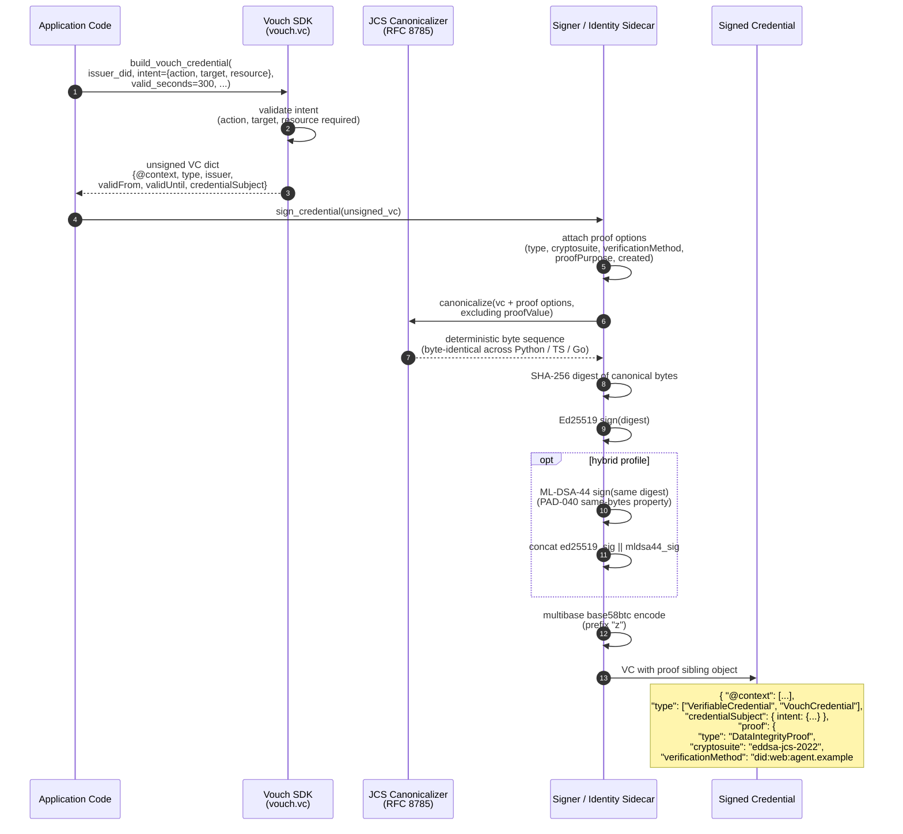

# 2.5 Credential Issuance Flow

End-to-end path from an application's intent to a signed W3C Verifiable
Credential with a Data Integrity proof attached as a sibling object.

Same path works for the default `eddsa-jcs-2022` cryptosuite and the
hybrid `hybrid-eddsa-mldsa44-jcs-2026` profile; the only difference is
whether ML-DSA-44 also signs the canonical bytes.

## What it answers

- What does `build_vouch_credential` actually return? An unsigned VC dict
  (no proof yet), ready for the signer to attach a Data Integrity proof.
- What gets signed? The JCS canonical bytes of the VC plus the proof
  options (everything except `proofValue` itself).
- Why JCS? It is byte-deterministic, so Python / TypeScript / Go all
  produce the same bytes for the same input. Verification across languages
  is then trivially correct.
- What changes for hybrid PQ? Both Ed25519 and ML-DSA-44 sign the SAME
  canonical-bytes digest. The two raw signatures are concatenated; the
  whole blob is base58-encoded into one `proofValue`. The credential
  structure is otherwise unchanged.
