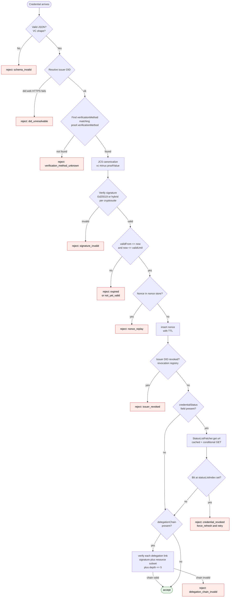

# 2.6 Credential Verification Flow

Decision tree a verifier walks when a credential arrives. Each step is
an independent check; the credential is accepted only if every check
passes. Failures emit a structured reason code so callers can react
specifically (refresh DID Doc, force-refresh status list, etc.).

## What it answers

- What order do checks happen in? Cheap, local checks first (schema,
  signature math), then network-dependent checks (DID resolution, status
  list fetch). Verifiers SHOULD short-circuit on the cheapest failures.
- What's the difference between issuer_revoked and credential_revoked?
  `issuer_revoked` means the entire DID has been revoked (DID-level
  registry, blanket effect). `credential_revoked` means just this
  specific credential has its bit set in a BitstringStatusList.
- When does force_refresh fire? When `credential_revoked` is returned
  from a cached status list. The verifier re-fetches with a conditional
  GET to confirm the bit really is set (and isn't a stale-cache artifact).
- What if there's a delegation chain? Each link is verified the same way
  (signature, validity window, resource subset, depth check). The whole
  chain must validate for the action credential to be accepted.
