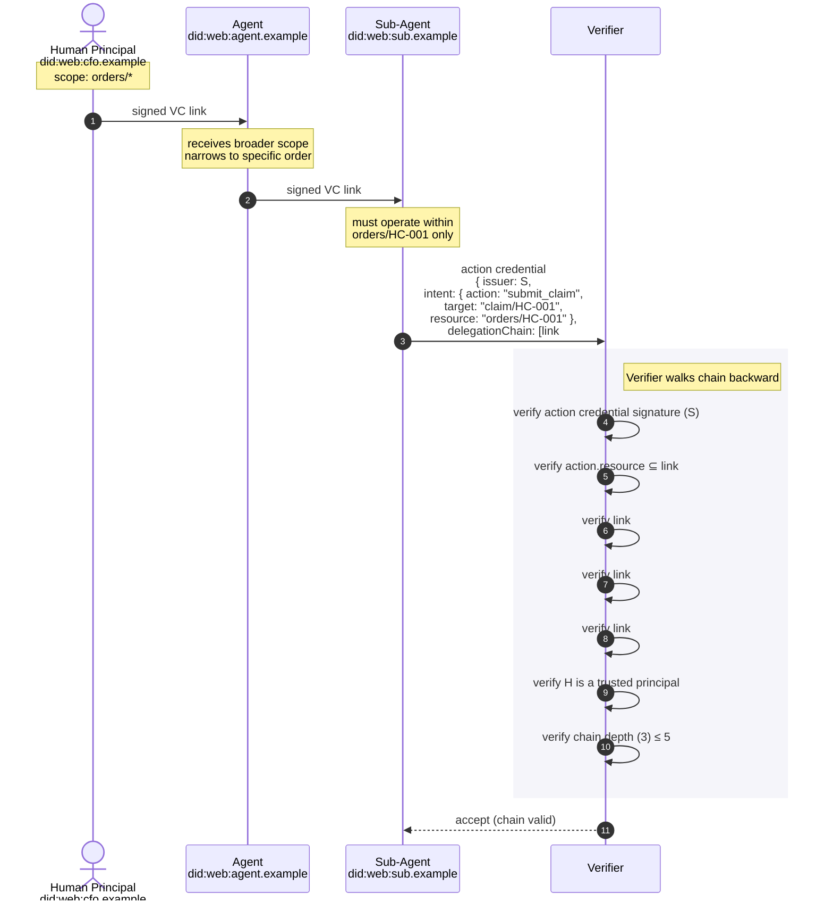
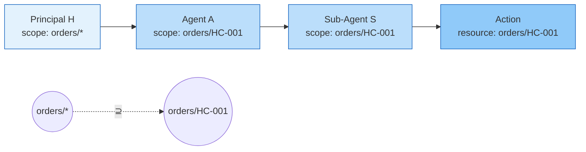

# 4.1 Delegation Chain Construction and Verification

How authority flows from a human principal down to the agent that
actually executes an action, with cryptographic proof at every link.

The example: a human principal authorizes an agent to manage orders,
who then sub-delegates to a sub-agent for one specific order. Each link
narrows the resource scope; the verifier walks the chain backward to
the principal.

## Resource narrowing visualized

## What it answers

- Who is ultimately responsible? The human principal at the top of the
  chain (`did:web:cfo.example` here). The chain proves that everything
  downstream was authorized by them.
- Can a sub-agent grant itself more authority than it was given? No. The
  resource-narrowing rule is enforced at verification: each link's
  resource scope MUST be a subset of the previous link's scope.
- What's the depth limit? 5 links maximum (W3C CG Report §9.4). Prevents
  unbounded chain growth and limits the verifier's walk cost.
- What does the verifier check at each link? Signature math (the
  issuer's public key in their DID Document verifies the signature) and
  the resource-subset condition.
- What happens if a middle link is revoked? If any link's issuer DID is
  in the revocation registry, OR any link's `credentialStatus` is set,
  the whole chain fails. The action credential cannot stand on a
  compromised parent.
